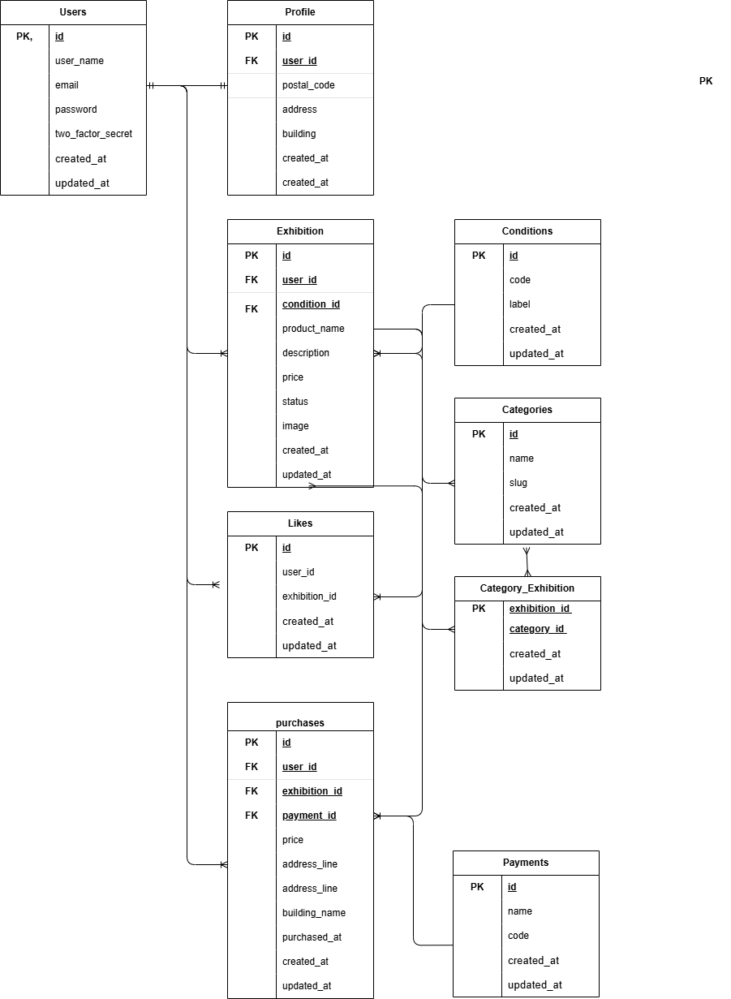

# _coachtech フリマ_

## _概要_
    独自開発のフリマアプリ

## _環境構築_
    1. git clone [リポジトリのURL]
        ※今回はhttps://github.com/bam600/fleamarket-app
    2. docker-compose up -d build
＊MySQLは、OSによって起動しない場合があるので、各PCにあわせて
docker-compose.ymlファイルを編集してください。

## _laravel環境構築_
    1.docker-compose exec php bash
    2.composer install
    3.env.exampleファイルから.envファイルを作成し、環境変数を変更
    4.php artisan key:generate
    5.php artisn make:mygrate
    6.php artisan db:seed
    
## _laravel fortifyの導入_
    1.docoker-compose exec php bash
    2.composer require laravel/fortify
    3.config/app.phpにApp\Providers\FortifyServiceProvider::class,を追加
    4.php artisan vendor:publish --provider="Laravel\Fortify\FortifyServiceProvider"
    5.App\Providers\FortifyServiceProvider.phpに
        Fortify::loginView(fn () => view('auth.login'));
        Fortify::registerView(fn () => view('auth.register'));をついか
    ＊必要に応じてルーティングやビューを調整

## _Livewireの導入_
    1.composer require livewire/livewire

## _使用技術(実行環境)_
### フレームワーク・ライブラリ
  - Laravel 10.x
  - Laravel Fortify（認証機能）
  - Blade（テンプレートエンジン）
  - Eloquent ORM（リレーション設計）
### フロントエンド
  - HTML / CSS（基本構造とスタイル）
  - Blade（Laravelのテンプレートエンジン）
### データベース
  - MySQL 8.x
  - Laravel Migration / Seeder / Factory（スキーマ・テストデータ管理）
### 開発ツール
- Visual Studio Code（推奨IDE）
- Laravel Artisan CLI（開発支援コマンド）
- Git（バージョン管理）

## _ER 図_

## _URL_
### 開発環境（ローカル）  
  `http://localhost:8000`  
  ＊docker-compose 実行後、Nginx/PHPコンテナが起動している状態でアクセス可能です。

### 認証画面（Fortify）  
  - ログイン：`http://localhost:8000/login`  
  - 登録：`http://localhost:8000/register`
